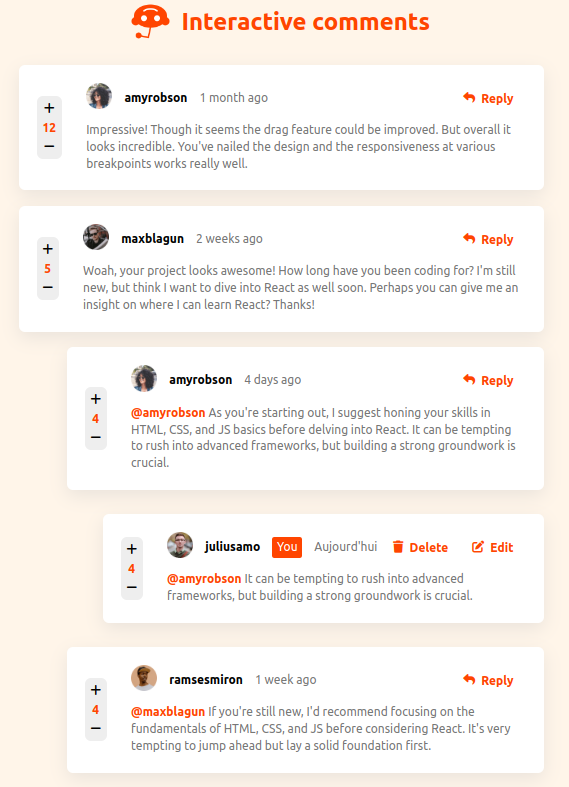

# Interactive comments

This is a solution to the [Interactive comments section challenge on Frontend Mentor](https://www.frontendmentor.io/challenges/interactive-comments-section-iG1RugEG9).

## Overview

### Features

Users are able to:

- View the optimal layout for the app depending on their device's screen size
- See hover states for all interactive elements on the page
- Create, Read, Update, and Delete comments and replies
- Upvote and downvote comments

### Screenshot



### Links

- Static demo URL: https://interactive-comments-js.netlify.app/

### Built with

- JavaScript
- [Nodejs](https://nodejs.org/en)
- [Express](https://expressjs.com/)

### Run

To run this project, follow these steps:

1. Clone the repository and run the following commands:

```bash
git clone https://github.com/JulienLach/Interactive-comments.git
cd Interactive-comments
node server.js
```

### Todo

- edit reply to reply.
- edit post.
- fix delete buttons console log errors.
- Instead of using the `createdAt` strings from the `data.json` file, use timestamps and dynamically track the time since the comment or reply was posted.
- use a database and store comments and replies.
